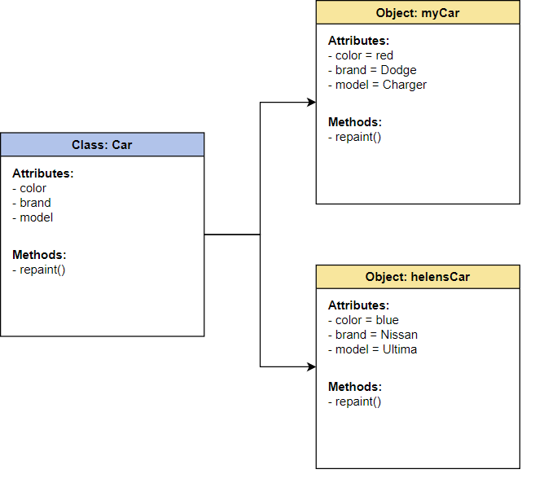

# Object-Oriented Programming
## What is OOP?
Object-Oriented Programming is a phrase that represents the conceptual way that programming languages that use this methodology behave: or, it does what it says on the box!

In a nutshell, OOP can be defined as a computer programming model that organizes software design around data, or objects, rather than functions and logic. 
An object can be defined as a data field that has unique attributes and behavior.

There are multiple programming languages that are considered *Object-Oriented* Programming Languages, among them:

- Java
- Ruby
- C++ & C#
- Python
- Javascript

 

## Data Modeling
Before starting an OOP program, the first step is data modeling. This provides an outline of how your program will look and what you need from it to have everything working. 
 

**Here is an example from a Reddit ElI5:**
>Let's think about creating an application for the card game '21' (i.e. blackjack).  
>
>You define the following objects needed in the game:
>
>- **Deck** - the deck of cards
>- **Card** - a card that is dealt
>- **Hand** - the set of cards that a player or the dealer has
>- **Dealer** - will track the dealer's hand
>- **Player** - an individual player
>- **Table** - a container object for the Dealer and all Player at a table
>
>Our **Deck** object will have the following properties and methods:
>- *Cards* - a set of cards to be dealt when needed.
>- *Shuffle* - a routine to shuffle the cards
>- *DealCard* - a routine to assign a single card to a hand
>
>Our **Card** object has the value of a card, with the following properties:
>- *PointValue* - The number of points (2 - 10, 10 for face cards, or 11 for ace)
>- *IsAce* - A flag because the Hand object needs to know if there is an ace in a hand, so it can treat it as a 1 instead of 11 if required
>
>Our **Hand** is a set of cards, with the following properties:
>- *Cards* - a set of Card objects currently in the hand
>- *Points* - the total number of points in the hand
>- *Bet* - the amount of money bet on the hand
>- *IsBusted* - A flag that the hand is over 21 and is a loser
>- *IsNatural* - A flag that the hand is 21 with exactly 2 cards
>
>Our **Hand** also has the following method:
>- ***Hit*** - Draw another card
>
>Our **Dealer** has the properties:
>- **Hand** - a Hand object
>- ***PlayHand*** - a method to have the dealer play out his hand (hit on 16, stand on 17, etc)
>
>Our **Player** has the properties:
>- **Hands** - could be more than one, if a player has split his hand
>- *Bankroll* - the amount of money the player has
>
>Our **Table** controls the play, and has the following:
>- *Players* - a set of all players in the game
>- **Dealer** - the dealer
>- ***Start*** - a method to start a new game for all players
>- ***Evaluate*** - a method to evaluate all Player hands against the Dealer after everyone is done, paying out winning bets to players and collecting losing ones for the house.
>
>This defines the basics of what the game needs. 
>
>Now, a developer can work on each piece individually. Since we have defined the relationships above, we can safely concentrate on the code needed for each object without interfering with other objects. For example, the mechanics of choosing a card from the deck does not affect a Hand object, since the Hand only cares that the PointValue and IsAce properties is correct.
>
>Another important thing is maintenance. 
>
>Suppose we build the game with basic functionality and get it working. Now, we want to add advanced features (ability to double, split hands, buy insurance, etc.). Since we have defined our objects well, we can work on just the affected objects, and the rest of the code (such as shuffling and dealing cards) should continue to work with no problem.

 

## Principles of OOP
The four main principles of Object-Oriented Programming are: 

- [Abstraction](#abstraction)
- [Encapsulation](#encapsulation)
- [Inheritance](#inheritance)
- [Polymorphism](#polymorphism)

### Abstraction
>**ELI5:**
>You have a toy. You drew a blueprint of the toy. Someone else can see that blueprint and build the toy.

Abstraction: to exist as an idea instead of physically. You code what your program is able to do without actuay doing it. Then people can come in and implement it using your abstract definition.

### Encapsulation
>**ELI5:**
>You have a toy. Put the toy in a box. It is still the same toy and does the same thing, but you (and other people/software) can't see it.

Encapsulation: to hide as if in a capsule. You hide direct access to your data and you hide how you are manipulating that data

### Inheritance
>**ELI5:**
>You have a big lego base plate. You can add anything you want to it that will fit but, the base will still be there.

Inheritance: to gain something from someone else. One piece of code can gain the traits and behaviors of another piece of code without duplicating the code

### Polymorphism
>**ELI5:**
>You have a baby toy set. Ball goes in the circle hole, block in the square hole. If one hole is big enough, both can go in it.

Polymorphism: Poly is many. Morphism is changing. Specifically, changing from one type of data to another. Or, having one type of data act like another.  
Think of inheritance: If object A inherits from B, then any piece of code that takes a "B" object can also take an "A" object, because all traits and behaviors of B are available in A.

 

## Structure of OOP

 

The structure, or building blocks, of object-oriented programming include the following:

- **Classes** - user-defined data types that act as the blueprint for individual objects, attributes and methods

- **Objects** - instances of a class created with specifically defined data.
Objects can correspond to real-world objects or an abstract entity. When class is defined initially, the description is the only object that is defined.

- **Methods** - functions that are defined inside a class that describe the behaviors of an object. 
Each method contained in class definitions starts with a reference to an instance object. Additionally, the subroutines contained in an object are called instance methods. Programmers use methods for reusability or keeping functionality encapsulated inside one object at a time.

- **Attributes** - defined in the class template and represent the state of an object. 
Objects will have data stored in the attributes field. Class attributes belong to the class itself.

 

## Benefits of OOP
- **Modularity**: Encapsulation enables objects to be self-contained, making troubleshooting and collaborative development easier.

- **Reusability:** Code can be reused through inheritance, meaning a team does not have to write the same code multiple times.

- **Productivity:** Programmers can construct new programs quicker through the use of multiple libraries and reusable code.

- **Upgradable / Scalable:** Programmers can implement system functionalities independently.

- **Interface descriptions:** Descriptions of external systems are simple, due to message passing techniques that are used for objects communication.

- **Security:** Using encapsulation and abstraction, complex code is hidden, software maintenance is easier and internet protocols are protected.

- **Flexibility:** Polymorphism enables a single function to adapt to the class it is placed in. Different objects can also pass through the same interface.