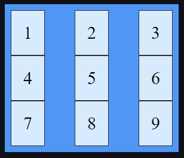

# CSS Using Bootstrap
## What is Bootstrap?
Bootstrap is a giant collection of handy, reusable bits of code written in HTML, CSS, and JavaScript. It’s also a frontend development framework that enables developers and designers to quickly build fully responsive websites.

Essentially, Bootstrap saves time by avoiding writing lots of CSS, giving back time to spend on designing webpages.

**Bootstrap is popular because it has:**
* Responsive Grid
* Responsive Images
* Selected JQuery plugins
* Components:
    * Navigation bars
    * Dropdowns
    * Progress bars
    * Thumbnails 

<br>

## Responsive Grid
Grid Layout creates a **12 column wide** grid-based layout system with rows and columns, making it easier to design web pages without having to use floats and positioning for CSS Box Model elements

### ```grid```
A basic grid layout contains a parent element with one or more child elements. Here is a nine-column grid, with three columns per row:
```html
<div class="grid-container">
  <div class="grid-item">1</div>
  <div class="grid-item">2</div>
  <div class="grid-item">3</div>
  <div class="grid-item">4</div>
  <div class="grid-item">5</div>
  <div class="grid-item">6</div>
  <div class="grid-item">7</div>
  <div class="grid-item">8</div>
  <div class="grid-item">9</div>
</div>
```

Now, to add CSS:  
```css
.grid-container {
  display: grid;
}
```
Which makes:  

<br>

### ```inline-grid```
An Inline-Grid has the same HTML layout as above, but with a single CSS change:
```html
<div class="grid-container">
  <div class="grid-item">1</div>
  <div class="grid-item">2</div>
  <div class="grid-item">3</div>
  <div class="grid-item">4</div>
  <div class="grid-item">5</div>
  <div class="grid-item">6</div>
  <div class="grid-item">7</div>
  <div class="grid-item">8</div>
  <div class="grid-item">9</div>
</div>
```
```css
.grid-container {
  display: inline-grid;             // changed display from grid to inline-grid
}
```
And the results:  


<br>

**Grid Columns: a visual guide**  


**Grid Rows: a visual guide**  


### Column Widths
Grid colums use the ```flex``` css selector. 
```css
.col
flex-basis: 0;
flex-grow: 1;
```

While ```.col``` is one selector for columns, there is also ```.col-1``` through ```.col-12```   

Notice how ```.col-4``` and ```.col-6``` behave:  
   
 ```.col-6``` has a built-in ```max-width``` of 50% of the available row space, while ```.col-4``` has a built-in ```max-width``` of 33% of the available row space

<br>


## Alerts
Alerts provide contextual feedback messages for typical user actions.
```html
<div class="alert alert-primary" role="alert">
  This is a primary alert—check it out!
</div>
<div class="alert alert-secondary" role="alert">
  This is a secondary alert—check it out!
</div>
<div class="alert alert-success" role="alert">
  This is a success alert—check it out!
</div>
<div class="alert alert-danger" role="alert">
  This is a danger alert—check it out!
</div>
<div class="alert alert-warning" role="alert">
  This is a warning alert—check it out!
</div>
<div class="alert alert-info" role="alert">
  This is a info alert—check it out!
</div>
<div class="alert alert-light" role="alert">
  This is a light alert—check it out!
</div>
<div class="alert alert-dark" role="alert">
  This is a dark alert—check it out!
</div>
```


<br>

## Breadcrumb

<br>

## Cards

<br>

## Carousel


